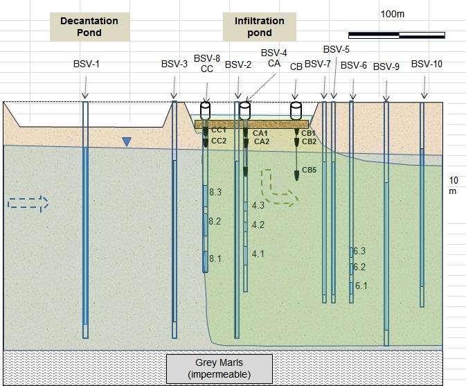

```{r eval=TRUE, include=FALSE, cache=FALSE}
#load("C:/Users/mrustl/Documents/WC_Server/R_Development/trunk/RPackages/kwb.demeau/demeau.RData")
load("C:/Users/hsonne/Desktop/R_Development/RPackages/kwb.demeau/demeau.RData")
library(magrittr) # for "%>%" pipe operator
library(kwb.demeau)

# overwrite functions modified by HS 
source("C:/Users/hsonne/Desktop/R_Development/RPackages/kwb.demeau/R/comparison.R")

library(plyr)
if (FALSE) {
################################################################################
# 1) Step: Import Data
## From Excel file 
#rawData <- importData(xlsPath = "C:/Users/mrustl/Documents/WC_Server/DEMEAU/Work Areas/WA1 MAR/TracerSVH/datosTOT_StVicen+º_jun2008-abr2009OK.xls")
#save(rawData,file = "C:/Users/mrustl/Documents/WC_Server/R_Development/trunk/RPackages/kwb.demeau/inst/extdata/monitoring/moniDat.RData")
# From R object (if Excel was already imported)
rawData <- importData()

################################################################################
# 2) Step: Data processing (aggregate to median daily values)
moniDat <- processingData(rawData = rawData)

# Infiltration pond area (m2)
shp.dir <- system.file("extdata", "qgis", package = "kwb.demeau")
shp.files <- dir(path = shp.dir, pattern = ".shp", full.names = TRUE)
gisData <- kwb.demeau::importShapefiles(shp.files)
ponds <- kwb.demeau::getFeatures(gisData,addColNames = "Area")
infiltrationPond_Area <- ponds$Area[ponds$Name == "Infiltration pond"] 


infPeriod <- kwb.demeau::filterMoniData(minDate = "2009-03-03", 
                            maxDate = "2009-04-02", 
                            df = moniDat$agg$dailyMedian)

infPeriod$TIME_day <- as.numeric(difftime(infPeriod$myDate,min(infPeriod$myDate) - 0.5,
                                          units = "days"))

iniAmbientTemp <- kwb.demeau::filterMoniData(paras = "Temp_C",
                                 minDate = "2009-02-28", 
                                 maxDate = "2009-03-02", 
                                 df = moniDat$agg$dailyMedian)

### Median GW temperature before infiltration 
#### (important note: ignored BSV-1 has 12 C !!! -> permanent infiltration????)
iniAmbientTempMedian <- aggregate(as.formula("parVal ~ moniLocation"), 
                                  data = iniAmbientTemp,FUN = median)
condition <- !iniAmbientTempMedian$moniLocation %in% c("Tuberia", "BSV-2_BARO65699", "BSV-1")
iniAmbientGwTempMedian <- median(iniAmbientTempMedian[condition,]$parVal)

print(sprintf("Initial GW temperature before infiltration: %2.3f C", iniAmbientGwTempMedian))

### Median pond temperature at Tuberia during infiltration period
pondTemp <- infPeriod[infPeriod$moniParName == "Temp_C" & infPeriod$moniLocation == "Tuberia",]
pondTempMedian <- median(pondTemp$parVal)

print(sprintf("Median pond temperature during infiltration: %2.3f C", pondTempMedian))

# Median daily inflow (m3/d) into infiltration pond between 2009-03-03 and 
# 2009-04-02
inflow_cbmPerHour <- infPeriod$parVal[infPeriod$moniParName == "Inflow_cbmPerH"]

medianInflow_cbmPerDay <- median(inflow_cbmPerHour)*24

print(sprintf("Median inflow to infiltration pond: %2.1f m3/h (%4.1f m3/day)",median(inflow_cbmPerHour), medianInflow_cbmPerDay))

### Infiltration rate per unit area (m/d)
infRate_perUnitArea <- medianInflow_cbmPerDay/infiltrationPond_Area
print(sprintf("Infiltration rate per unit pond area: %1.3f m/d",infRate_perUnitArea))
}

```

\pagebreak

#Introduction
**Background**

Within the DEMEAU project a xxxxx 


**Objective** 

Modelling of heat transport during MAR for a case study site in Spain for
identifying key processes in the subsurface. 
  
\pagebreak  

#Material & Methods 
## Energy transport modelling in variable-saturated porous media 
### Theoretical background
The energy transport equation is defined as followed 
[Healy and Ronan, 1996](<http://pubs.er.usgs.gov/pubs/wri/wri964230>):  

$$  \delta / \delta t  [\theta C_W +  (1 - \phi)C_S] T  =  
    \triangle * K_T(\theta)  \triangle T +
    \triangle * \theta C_W D_{Hi,j} \triangle T -
    \triangle \theta C_W \nu T +
    qC_W T^*
$$ 

with: 

$\triangle$ - spatial gradient (in $m^{-1}$), i.e. 
              $\delta/\delta x + \delta/\delta y +\delta/\delta z$
      

$t$ - time (in $s$)

$\theta$ - volumetric moisture content

$\phi$ - porosity

$C_W$ - heat capacity (i.e. density times specific heat) of water (in $J/m^3?C$)

$C_S$ - heat capacity of dry solid (in $J/m^3?C$)

$T$ - temperature (in $?C$)

$K_T$ - thermal conductivity of water and solid matrix tensor (in $W/m?C$)

$\nu$ - water velocity (in $m/s$)

$q$ - rate of fluid source (in $s^{-1}$)

$T^*$ - temperature of fluid source (in $?C$)

$D_{Hi,j}$ - hydrodynamic dispersion tensor (in $m^2/s$) defined as: 
            $\alpha_T|\nu|\delta_{ij} + (\alpha_L - \alpha_T)v_iv_j/|\nu|$
            
* with: 
 + $\alpha_T$ - transverse dispersivity of the porous medium (in $m$)
 
 + $\alpha_L$ - longitudinal dispersivity of the porous medium (in $m$)
 
 + $|\nu_i|$ - $i^{th}$ component of the velocity vector (in $m/s$) 
 
 + $|\nu|$ - magnitude of the velocity vector (in $m/s$) 
 
 + $\delta_{i,j}$ - Kronecker delta (equals 1 if $i = j$, otherwise equals to 0)

In case of unsaturation conditions, this equation ignores the possible impact of
the air phase on the heat transport. However, as this term is normaly small 
compared to that of water, neglecting the term will not impact the modelling results 
substantially for practical purposes ([Healy and Ronan, 1996](<http://pubs.er.usgs.gov/pubs/wri/wri964230>)).

In total four processes impact the energy transport:

* **Thermal conduction** (first term of right hand side of equation 1): 

* **Thermo-mechanical dispersion** (second term of right hand side of equation 1)
    + Mechanical dispersion: variations of velocity field at the microscopic level 
    due to the tortous nature of flow paths through porous media
    + Hydrodynamic dispersion: molecular diffusion due to variations in temperature
    in space (e.g. )

* **Advective energy transport** (third term of right hand side of equation 1)
    
* **Sources / sinks** (fourth third term of right hand side of equation 1)

### Software
#### VS2DHI
For this study the software VS2DHI (for further information 
[see](<http://wwwbrr.cr.usgs.gov/projects/GW_Unsat/vs2di1.3//>)), developed by 
the United States Geological Survey (USGS) and provided for free was selected for 
modelling the subsurface heat transport because it: 

- is open-source & well documented and thus

- can be easily automatised (e.g. by using programming language R)

The required model parameters and its sensitivities for simulating heat transport
are shown in Tab.1:

*Tab.1: VS2DH model parameters to model heat as a tracer through alluvial sediments* (from: [Stonestorm & Constantz, 2003](http://pubs.usgs.gov/circ/2003/circ1260/pdf/Circ1260.pdf>))


\pagebreak

#### R & RStudio 
VS2DHI provides a:

- a preprocessor for setting up a model simulation,

- a numerical model, VS2DH 3.3, for computing flow and transport and 

- a postprocessor for visualizing simulation results.

However, its pre-processor offers no advanced features like for example 
automatically changing model input parameters (e.g. hydraulic conductivty) and 
performing model batch runs, which is required for an automatised, reproducible 
model calibration. 

To overcome this drawback the programming language R (<http://www.r-project.org>) 
in conjunction with the user friendly integrated development enviroment (IDE) 
RStudio (<http://www.rstudio.org>) is chosen for this study in order to perform: 

- Data analysis: checking and visualising available monitoring data

- Data preparation: e.g. summarising of monitoring data (e.g. calculation of 
statistical parameters: median, percentiles, and so on)

- Automatised VS2DHI model runs & result evaluation 


\newpage

##Case study site
The case study is a MAR site in the Llobregat River Delta Aquifer in Spain close 
to Barcelona. A vertical cross-section of the case study site showing the locations 
of the monitoring points is shown in Fig.2:


*Fig.2: Vertical cross-section of case-study site*

\pagebreak

###Available data

The following data is available for the study period (January - April 2009): 

- Surface area of settling basin (4000 m2) and infiltration pond (5600 m2) ([ENSAT, 2013](<http://www.life-ensat.eu/wp-content/uploads/2013/01/ENSAT_LAYMANS_baja.pdf>))

- Inflow rate to infiltration pond (daily values )

- Air temperature & atmospheric pressure at the site (5 min values)

- Groundwater temperature & water column pressure at different monitoring wells (5 min values)


However, no data is available on:

- Surface water levels & temperatures: Llobregat River, settling basin or
infiltration pond 

- Sediment water content or water pressure in below infiltration pond 

- Coordinates of the observation points 

- Absolute elevations: for deriving absolute groundwater levels (in meter a.s.l.) 


###Data pre-processing

The following data pre-processing steps were performed after importing the raw 
data from the original EXCEL spreadsheet into R:

1. **Temporal aggregation:** frequently (in general: every five minutes) measured 
parameters (barometric pressure, water column, temperature, electronic 
conductivity) were aggregated to **daily median** values 

2. **Calculations** 
  + Water column: correction of water column pressure with atmospheric pressure 

  + Water level change: difference between water column at time X compared to 
    water column before the start of infiltration period (i.e. 02/03/2009)

No data pre-processing was necessary for the inflow rate to the infiltration pond, 
as this information was only available with a daily temporal resolution. 

The resulting time series of water level change, temperature for all available 
monitoring points after data pre-processing step are shown in Fig.3 (bottom). 
In addition, also the inflow rate to the infiltration pond is shown (Fig.3, top).
However, in case of this information no data-preprocessing was necessary, because 
these data were already available with a daily temporal resolution. 

\newpage
```{r fig.width=10, fig.height=2.5,eval=TRUE, echo=FALSE}

tmp <- renameValues(df = moniDat$agg$dailyMedian,
             colName = "moniLocation",
             oldVal = "BSV-2_BARO65699", 
             newVal="Air (BSV-2_BARO65699)"
              ) 


infiltration <- filterMoniData(locations = "InfiltrationPond",
                               df = tmp)


lattice::xyplot(as.formula("parVal ~ myDate | moniLocation"), 
       xlab = "",
       ylab = "", #"Inflow (m3/h)", 
      panel = function(...) {
                   panel.xyplot(...)
                   panel.abline(v = infiltration$myDate, 
                                col = "lightgrey", 
                                lty = 2, 
                                lwd = 0.5) 
                 },
       type = "h", 
       lwd = 5, 
       main = "Inflow (m3/h)",
       data = infiltration)
```


```{r fig.width=10, fig.height=10.5, eval=TRUE, echo=FALSE}
myLocations <- c("Air (BSV-2_BARO65699)",
                 "BSV-1", 
                 "BSV-3", 
                 "BSV-2", 
                 "BSV-4_1",
                 "BSV-4_3",
                 "BSV-5", 
                 "BSV-6_2",
                 "BSV-6_3")


selDat <- kwb.demeau::filterMoniData(df = tmp, locations = myLocations)
numberOfLocations <- length(unique(selDat$moniLocation))
kwb.demeau::plotMonitoringWithTwoYAxes(df = selDat, 
                           as.table = TRUE, 
                           layout = c(1,numberOfLocations)
                           )
```

*Fig.3: Time series of inflow rates into infiltration pond (top) and water level change (blue) and temperature (purple) for different monitoring points (bottom) after data-preprocessing (bottom)*


###VS2DI model

The general framework and steps for building a numerical model for simulating 
heat transport is described in detail in [Appendix B, Stonestorm & Constantz, 2003](http://pubs.usgs.gov/circ/2003/circ1260/pdf/Circ1260.pdf>) and is used for this case 
study as a role model.

#### Model structure

For this study a two dimensional vertical cross section of the MAR site is 
modelled

The model structure of the unsaturated zone, the aquifer and the filter screens 
of the observation wells (piezometers) are deduced from *Fig.1* and implemented 
in the VS2DHI model as shown below in Fig.2.
```{r fig.width=10, fig.height=8,eval=TRUE, echo=FALSE}
### Importing GIS features
# shp.dir <- system.file("extdata", "qgis", package = "kwb.demeau")
# shp.files <- dir(path = shp.dir, pattern = ".shp", full.names = TRUE)
# gisData <- kwb.demeau::importShapefiles(shp.files)
# ### Optionally remove some features 
# #getFeatures(gisData)
gisData <- kwb.demeau::removeFeatures(gisData = gisData, 
                          ignoreFeatureIDs = 20 ## id 20: settling basin
)

### Heat model  
#### 1) Prepare
preparedHeatModel <- kwb.demeau::prepareModel(gisData = gisData,
                                      type = "heat",
                                      rech_pondInfRate = infRate_perUnitArea,
                                      rech_pondTemp = pondTempMedian, 
                                      init_gwTemp = iniAmbientGwTempMedian,
                                      flow_satKh = 440.4667,
                                      flow_ratioKzKh = 0.01)

kwb.demeau::plotModelStructure(df = preparedHeatModel$modelStructure$features)
```
*Fig.2: VS2DHI heat model structure*

For simulating the unsaturated zone characteristics the **van Genuchten Model** 
is used with the following parameterisation: 

```{r echo=FALSE}
models <- kwb.demeau::genuchtenModels(pressureHeads = -rev(seq(0,6.5,0.5)), 
                                      alphas = 2, 
                                      betas = 5)
models$effSaturation <- models$effSaturation*100

lattice::xyplot(as.formula("pressureHead ~ effSaturation | label"), 
                ylim = rev(c(min(models$pressureHead),0)),
                xlim = c(0,100), type = "b", pch = 16,
                 ylab = "Pressure head (in meter)",
                    xlab = "Effective saturation (in %)", 
                data = models, auto.key = TRUE, as.table = TRUE)

```

#### Boundary conditions 

The following boundary conditions are implemented in the numerical model

- **Constant flux boundary** (Neuman condition): infiltration from the infiltration 
pond to the unsaturated/saturated zone is assumed to be constant for the whole 
infiltration period and set equal to the median inflow rate (`r median(inflow_cbmPerHour)`
m3/h or `r median(inflow_cbmPerHour)*24` m3/day) to the infiltration pond. As the 
model requires the recharge rate per unit pond area this value needed to be divided 
by the infiltration pond surface area (`r infiltrationPond_Area` m2) resulting in an 
infiltration rate per unit area of `r infRate_perUnitArea` m/day. Note that this 
approach assumes that no water is neither lost through evapotransportion nor 
stored in the pond, thus possibly overestimating the real infiltration rate.

```{r echo=FALSE}

```

- **Constant head boundaries** (Dichichlet condition): upstream/downstream of MAR 
ponds (derived from neighboring observation piezometers under "undisturbed" 
conditions, i.e. without infiltration!)

#### Initial conditions
For each active node inside the model boundaries of the numerical model initial 
values for both, head and temperature are required.

#### Model parameter data

#### Observation data

**Requirements:** (from: [Stonestorm & Constantz, 2003](http://pubs.usgs.gov/circ/2003/circ1260/pdf/Circ1260.pdf>))

1. **Accurate data:** i.e. head (for saturated soils), water content (for 
unsaturated soils) and temperature

2. **Spatio-temporal accuracy:** coordinates of observation points and sampling time

3. **Temperature data**: should show a high variability 

For finding an unique solution two aspects of temperature variation need to be 
simulated: 

1. **Attenuation of the temperature signal's amplitude**

2. **Shift in the temperature signal's phase in the direction of groundwater movement** 

#### Model calibration 

\pagebreak

#Modelling results

##Calibration 
For calibration a period of continious recharge from 3/03/2009 until 02/04/2009
was used.

**Assumptions:**

- All water discharged to infiltration pond is infiltrating (no change in water 
level in infiltration pond and no evapotranspiration)

```{r eval=TRUE, include=FALSE, cache=FALSE, echo = FALSE}
if (FALSE) {
  heatModel <- kwb.demeau::runHeatModel(preparedHeatModel = preparedHeatModel)
}
objCrit <- c("RMSE", "R2", "PBIAS")
```

```{r fig.width=18, fig.height=8,eval=TRUE, echo=FALSE}
fitnessWaterLevelChange <- fitnessWithLabel(
  heatModel = heatModel, 
  moniDat = moniDat,
  objState = "waterLevelChange", 
  objCrit = objCrit,
  main = "", 
  cex.label = 2,
  performance.in.label = FALSE
)
```

```{r fig.width=18, fig.height=8,eval=TRUE, echo=FALSE}
fitnessTemp <- fitnessWithLabel(
  heatModel = heatModel, 
  moniDat = moniDat,
  objState = "temp", 
  objCrit = objCrit,
  main = "", 
  cex.label = 2,
  performance.in.label = FALSE
)
```

##Travel times

```{r eval=TRUE, include=FALSE, cache=FALSE, echo = FALSE}
### Solute transport model  
#### 1) Prepare
if (FALSE) {
preparedSoluteModel <- prepareModel(gisData = gisData,
                                       type = "solu",
                                       rech_pondInfRate = infRate_perUnitArea,
                                       rech_pondTemp = pondTempMedian, 
                                       init_gwTemp = iniAmbientGwTempMedian,
                                       time_outputTimeStep = 0.01,
                                       time_minSimTime = 0.1, 
                                       time_maxSimTime = 30.5,
                                       flow_satKh = 440.4667,
                                       flow_ratioKzKh = 0.01)


## 2) Run 
soluteModel <- runSoluteModel(preparedSoluteModel = preparedSoluteModel)
}
```

```{r fig.width=14, fig.height=8,eval=TRUE, echo=FALSE}
### 3) Plot figure
solute <- soluteModelled(soluteModel = soluteModel,offset = 0.01)

```

```{r fig.width=5, fig.height=8,eval=TRUE, echo=FALSE, results = 'asis'}
### 3) Plot table
domTravelTimes <- solute$domeTimes$agg
domTravelTimes$maxConc <- round(domTravelTimes$maxConc * 100, 0)
domTravelTimes$Name <- as.character(domTravelTimes$Name)

domTravelTimes <- domTravelTimes[,c("Name","TIME_day", "maxConc" )] %>%  plyr::rename(c(Name = 'MoniWellId', 
                                   TIME_day = "Dominant travel time (days)",
                                   maxConc = "Share of infiltrate (%)"))


rmarkdownTable <- function(df){
  cat(paste(names(df), collapse = "|"))
  cat("\n")
  cat(paste(rep("-", ncol(df)), collapse = "|"))
  cat("\n")

  for (i in 1:nrow(df)) {
    cat(paste(df[i,], collapse = "|"))
    cat("\n")
    }
invisible(NULL)
}

rmarkdownTable(domTravelTimes)
```

```{r echo=FALSE}
#Export Data to CSV
exportCSV <- function(objects =  c("fitnessTemp", 
                                    "fitnessWaterLevelChange", 
                                    "domTravelTimes"),
                       tDir = tempdir(),
                      openDir = TRUE) {
for (object in objects) {
write.csv(x = get(object),file = file.path(tDir, paste0(object,".csv")))
if (openDir) kwb.utils::hsOpenWindowsExplorer(tDir)
}
}
exportCSV()
```
\pagebreak

#Conclusions & Outlook


